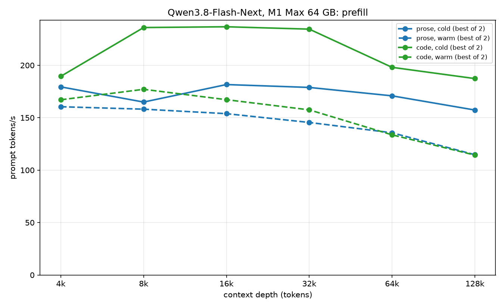
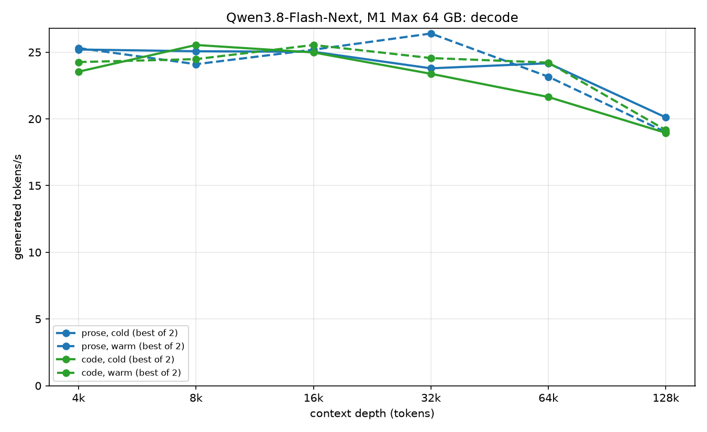

# llama.cpp — very large MoE models on a 64 GB Mac

A fork of [llama.cpp](https://github.com/ggml-org/llama.cpp) for running MoE models **far larger
than available RAM** by streaming their routed experts from SSD on demand, tuned specifically for
Apple Silicon.

Testing hardware: **M1 Max, 64 GB, ~400 GB/s**. Everything except the routed experts stays resident;
the experts live in a bounded cache filled by demand loads and a one-layer-ahead prefetcher. The
usable checkpoint size is therefore set by **disk throughput, not by RAM** — a 284B model in 107 GiB
runs on a machine with 64 GB, at a speed that is genuinely usable for agentic coding.

Decode at depth is dominated by the KV read, not by weight traffic, which is why streaming the
experts costs so little once the context is deep. That is the entire premise of this approach, and
most of the optimisation effort targets prefill and long context rather than short-prompt decode.

---

## Support the Project

If this work is useful to you, a small donation is greatly appreciated and helps fund continued
development.

[](https://www.paypal.com/cgi-bin/webscr?cmd=_donations&business=mihailescu2m%40gmail%2Ecom&lc=AU&item_name=memeka&item_number=odroid&currency_code=AUD&bn=PP%2DDonationsBF%3Abtn_donate_LG%2Egif%3ANonHosted)

---

## Performance

Qwen3.8-Flash-Next with its MTP head on the M1 Max 64 GB, measured with
[llama-benchy](https://github.com/eugr/llama-benchy) against `llama-server` from 4k to 128k tokens of
context. **Cold** processes the whole context from scratch; **warm** sends a 2048-token prompt on top
of the already-cached context. Every request generates 256 tokens. Prose is *War and Peace*, code is
the llama.cpp sources; figures are the best of two runs, from the server's own timings. Both the
excerpts llama-benchy picks and the server's sampling use a fixed seed (1234), so runs repeat. Server
settings as in [Running](#running), with a 147456-token context, no mmproj and default flags.





**Prefill** (tokens/s)

| Depth | Prose cold | Prose warm | Code cold | Code warm |
|---|---:|---:|---:|---:|
| 4k | 179.4 | 160.5 | 189.5 | 167.1 |
| 8k | 164.9 | 158.1 | 236.0 | 177.1 |
| 16k | 181.6 | 153.9 | 236.7 | 167.2 |
| 32k | 178.9 | 145.5 | 234.5 | 157.5 |
| 64k | 170.9 | 135.6 | 198.0 | 133.7 |
| 128k | 157.3 | 114.7 | 187.3 | 114.3 |

**Decode** (tokens/s, MTP acceptance in brackets)

| Depth | Prose cold | Prose warm | Code cold | Code warm |
|---|---:|---:|---:|---:|
| 4k | 25.20 (0.53) | 25.31 (0.55) | 23.54 (0.55) | 24.26 (0.58) |
| 8k | 25.07 (0.57) | 24.10 (0.50) | 25.54 (0.64) | 24.48 (0.56) |
| 16k | 25.03 (0.55) | 25.19 (0.56) | 24.98 (0.58) | 25.54 (0.60) |
| 32k | 23.79 (0.55) | 26.40 (0.66) | 23.38 (0.56) | 24.56 (0.62) |
| 64k | 24.17 (0.66) | 23.16 (0.62) | 21.64 (0.57) | 24.22 (0.69) |
| 128k | 20.11 (0.62) | 19.00 (0.56) | 18.95 (0.57) | 19.16 (0.59) |

Against the previous table, decode is +10-16% at every depth: the expert remap now runs inside the
command buffer instead of splitting the graph at every MoE layer, and the hyper-connection mixers
have faster mat-vecs. Prefill is level; the cold figures read the experts from SSD and move by
5-15% between runs (a same-session A/B at 4k/8k put this build level with or ahead of the previous
one).

---

## Building

Standard llama.cpp build; Metal is the only backend this fork is tuned for.

```bash
cmake -B build -DGGML_METAL=ON
cmake --build build -j8 --config Release
```

---

## Running

The configuration this fork is tuned on: Qwen3.8-Flash-Next with its MTP head and 128k context on an
M1 Max 64 GB.

```bash
LLAMA_MOE_STREAM_LOOKAHEAD=16 LLAMA_SPEC_DRAFT_MOE_SLOTS=512 \
LLAMA_SPEC_REJECTION=1 LLAMA_SPEC_MTP_REJECTION=1 \
llama-server \
  --model model.gguf --mmproj mmproj.gguf \
  -ngl 99 -t 8 --flash-attn on \
  --moe-stream --moe-stream-cache 28 --moe-stream-io-threads 8 \
  -c 131072 -ctxcp 4 --load-mode dio -b 4096 -ub 4096 -cms 4096 -np 1 \
  [-ctk f16 -ctv f16] -cram 0 \
  -md mtp.gguf --spec-type draft-mtp [--spec-draft-n-max 3] \
  [--spec-draft-p-min 0] --spec-draft-ngl 99 \
  --spec-mtp-ngram-n-max 3 --spec-ngram-mod-n-match 8 \
  --ubatch-size-decode 32 [--moe-stream-cache-decode auto] [--prompt-decode-max 640] \
  --slot-save-path slots --slot-persist \
  --context-cache-path context-cache --context-cache-slots 3 \
  --temp 1.0 [--top-p 0.95] --min-p 0.01 \
  [--metrics] --host 0.0.0.0 [--port 8080]
```

---

## What this fork adds on top of upstream

### Kernel fixes carried ahead of upstream

* **Flash-attention unroll cap at `DK = 512`** - upstream's `MIN(DK8/2, 4*NSG)` guard folds to a 32x
  unroll that runs 3.97x slower on M1 Max; the cap keeps DeepSeek's 512-wide heads on the fast path.
* **Byte-indexed MXFP4 dequant** - one half2 table lookup decodes both nibbles of a byte, halving the
  lookups in the MXFP4 mat-vec.
* **Aligned q8_0 KV loads** - naturally aligned halfword loads for q8_0 KV dequant on Metal.

### MoE expert streaming

* **Routed experts streamed from SSD** (`--moe-stream`, `--moe-stream-cache`,
  `--moe-stream-io-threads`, `--moe-stream-direct`) - llama.cpp can run MoE models larger than RAM:
  routed experts are read from the GGUF on demand into a bounded per-layer cache, with parallel slab
  reads, hotness-based eviction and zero-copy loads into the Metal shared buffer. This is what fits
  the 107 GiB DeepSeek V4 on a 64 GB Mac.
* **Pair-partitioned prefill waves** (`LLAMA_MOE_STREAM_PARTITION`, on) - when a ubatch touches more
  experts than the cache holds, each (token, expert) pair is computed once, in the wave that holds
  its expert, instead of every wave running over every pair. Prefill +37%.
* **Lookahead prefetch** (`LLAMA_MOE_STREAM_LOOKAHEAD`, default n_expert_used) - layer L+1's router
  predicts its experts from layer L's input, so their reads start a layer early. DeepSeek decode
  6.0 -> 7.3 t/s; Qwen at width 16 -3.2% ms per step at 16k.
* **Hash-layer preload** (`LLAMA_MOE_STREAM_NO_HASH_PREFETCH` disables) - DeepSeek's token-id-routed
  first layers start their reads before layer 0 instead of stalling on them; those 3 of 43 layers
  were 36% of the decode misses.
* **Phase-aware memory** (`--ubatch-size-decode`, `--moe-stream-cache-decode`,
  `--prompt-decode-max`) - after the prompt, the server drops to a small decode ubatch and gives the
  freed compute workspace to the expert cache, resized in place and refilled with the experts decode
  used last (`LLAMA_MOE_STREAM_INPLACE`, `LLAMA_MOE_STREAM_WARM`). Decode +10-12% on Qwen, +14% on
  DeepSeek; phase switches 2.9 -> 1.1 s.

### Metal kernels

* **Expert and small-batch mat-vecs** - IQ3_XXS codebooks read by word, wider MXFP4 row tiles, more
  rows per simdgroup, and one token per threadgroup for the 2-8 token verify batches of speculative
  decoding; for Qwen's hyper-connection mixers, 8 rows per simdgroup on the short Q8_0 up-projection
  (K = 320: 81 -> 47 us at 4 tokens) and more loads in flight on the 4-row F32 inject (38 -> 23 us).
  Bit-identical, -7.3% ms per decode step, and the mixer kernels +3-5% Qwen decode on top.
* **`MUL_MAT_ID` over used tiles only** - the expert GEMM runs only over the (expert, tile) pairs
  that hold tokens instead of launching threadgroups that find nothing. Prefill GPU time -7.0%.
* **Contiguous `CPY` fast path** - same-type contiguous copies move uint4s: the recurrent-state
  copies go 72.5 -> 10.7 us, -4.9% per decode step.
* **Heads-as-rows sparse flash attention** (`GGML_METAL_FA_SPARSE_HR`, on) - for GQA prefill with a
  sparse mask, one threadgroup per (token, KV head) makes the heads sharing the KV head the rows of a
  simdgroup-matrix tile, so each selected K/V row is loaded once per token; dense FA is kept while the
  KV range is under 3x the selection. 3.5-5x faster than the vec kernel; Qwen prefill +16-18% at
  16-64k against the best previous path. Not bit-identical to the vec kernel.
* **Expert remap without graph splits** (`GGML_METAL_HOST_OPS`, on) - the expert-cache remap was a
  CPU op between two GPU splits at every MoE layer, so the GPU drained and waited ~0.5 ms for the host
  each time. It now runs on a host thread while the command buffer waits on an event. Byte-identical
  output; decode +9% on Qwen, +21% on DeepSeek V4.
* **Residency kept for the process lifetime** (`GGML_METAL_RESIDENCY_KEEP_ALIVE_S`) - upstream unwires
  the buffers 180 s after the last compute, after which a model that fills the machine is compressed
  or swapped and the next request stalls (~40 s measured). The fork keeps them wired while the
  process runs; `N > 0` restores a timeout.

### DeepSeek

* **Union-8 sparse attention** (`LLAMA_DSV4_UNION`, on; `LLAMA_DSV4_UNION_MIN_NCSA`, 4096) - blocks
  of eight prompt queries share one deduplicated top-k list, so prefill reads each selected row once
  per block instead of once per query, with each query's membership kept exact. Its chunked bitmap
  keeps the path engaged at long context instead of falling back to dense.

### Qwen3.8-Flash-Next

* **Block-level indexer selection** - the QSA indexer selects whole blocks instead of materialising
  an `[n_kv, n_tokens]` cell table on every layer, cutting prefill's quadratic term.
* **PLE row prefetch** (`LLAMA_PLE_PREFETCH`, on) - every per-layer-embedding row a ubatch will
  gather from the 26.8 GiB table is advised to the kernel first. -4.8% ms per decode step, prompt
  -6.7%.
* **Gathered QSA prefill** (`LLAMA_QSA_GATHER=1`, opt-in; `LLAMA_QSA_GATHER_MIN_KV`, 8192) - flash
  attention reads only the selected cells, eight queries sharing their union. Cold prefill -7.4% at
  50k tokens; not bit-identical.
* **Native MTP draft head** - the model's own NextN block drafts for speculative decoding.

### Speculative decoding

* **Rejection sampling** (`LLAMA_SPEC_REJECTION`, `LLAMA_SPEC_MTP_REJECTION`, opt-in) - on sampled
  requests a draft token is accepted with probability min(1, p_target/q) rather than only on an exact
  match, so more drafts are kept for the same output distribution. MTP acceptance 0.537 -> 0.590,
  decode +6.5%.
* **N-gram suffix** (`--spec-mtp-ngram-n-max N`) - after a full MTP draft, up to N more tokens come
  from the verified history. Code edits +8.0% decode at N = 3; changes greedy text.
* **Bounded drafting** (`--spec-max-prompt`, `LLAMA_SPEC_DRAFT_UBATCH`, `LLAMA_SPEC_DRAFT_MOE_SLOTS`)
  skips the drafter's prefill on very long prompts and caps its ubatch and expert cache, so it never
  takes memory the target needs. The drafter's state also survives prompt-cache restores and
  checkpoint rollbacks, so it does not have to resynchronise.

### SSD checkpoints and context cache

* **Persistent slot** (`--slot-persist`) - the most recent conversation and its prompt checkpoints
  are saved on exit and restored on start: 5994 tokens back in 0.16 s instead of re-prefilled.
* **SSD context cache** (`--context-cache-path`, `--context-cache-slots`) - idle conversations spill
  to SSD instead of RAM and survive restarts; resuming one after a restart processed 258 tokens
  instead of re-prefilling 4724. Saved state is keyed by model, settings and graph switches, so a
  mismatch is refused rather than reused.

---

## The two models, and why they are hard

They are hard in completely different ways, which is why each has its own log.

### DeepSeek-V4-Flash-0731 — the I/O problem

284B, 256 experts per layer. The model is 107 GiB and the machine has 64 GB, so the experts must
come off the disk *while the GPU waits*. Everything is about hiding that latency: prefetch far
enough ahead, keep the right experts resident, and never let a demand read queue behind speculative
work.

→ **[Research log](docs/DeepSeek-V4-Flash-0731.md)** — kernel survey, features, negative results.

### Qwen3.8-Flash-Next — the graph-shape problem

Fast enough that the bottleneck left the disk entirely. What remained was GPU work the graph did not
need to do: a reshape that silently broke Metal's `RMS_NORM→MUL` fusion, copies that bought nothing,
a full sort of 512 expert scores to read the top 10, and an indexer materialising a table
proportional to context × chunk size on every layer. Plus three genuinely awkward architectural
features: four parallel residual streams, a 26.8 GiB PLE table that cannot be resident, and a native
MTP head whose hidden-state contract has three separate ways to fail silently.

→ **[Research log](docs/Qwen3.8-Flash-Next.md)** — kernel survey, features, negative results.

---

## On the research logs

Both logs record **negative results as first-class content**, not as an appendix. Roughly half the
entries are ideas that look obviously correct on paper and cost real GPU time to disprove.

That is deliberate. On hardware this constrained, knowing which plausible optimisation *does not*
work — and why — has been worth more than the wins.

Each log also carries a **kernel survey**: every quant format the checkpoint could use, measured at
that model's own expert-GEMM shape, ranked by time per *effective* bit-per-weight. The ranking does
not match intuition — on this GPU the i-quant kernels are occupancy-bound and lose to simpler formats
that read more bytes.

---

## Upstream

This fork tracks [ggml-org/llama.cpp](https://github.com/ggml-org/llama.cpp). Upstream documentation
applies for everything not listed above; see [the upstream README](https://github.com/ggml-org/llama.cpp#readme)
for supported backends, model conversion and the general tool set.

Bugs found here that belong upstream are noted as such in the model logs.
